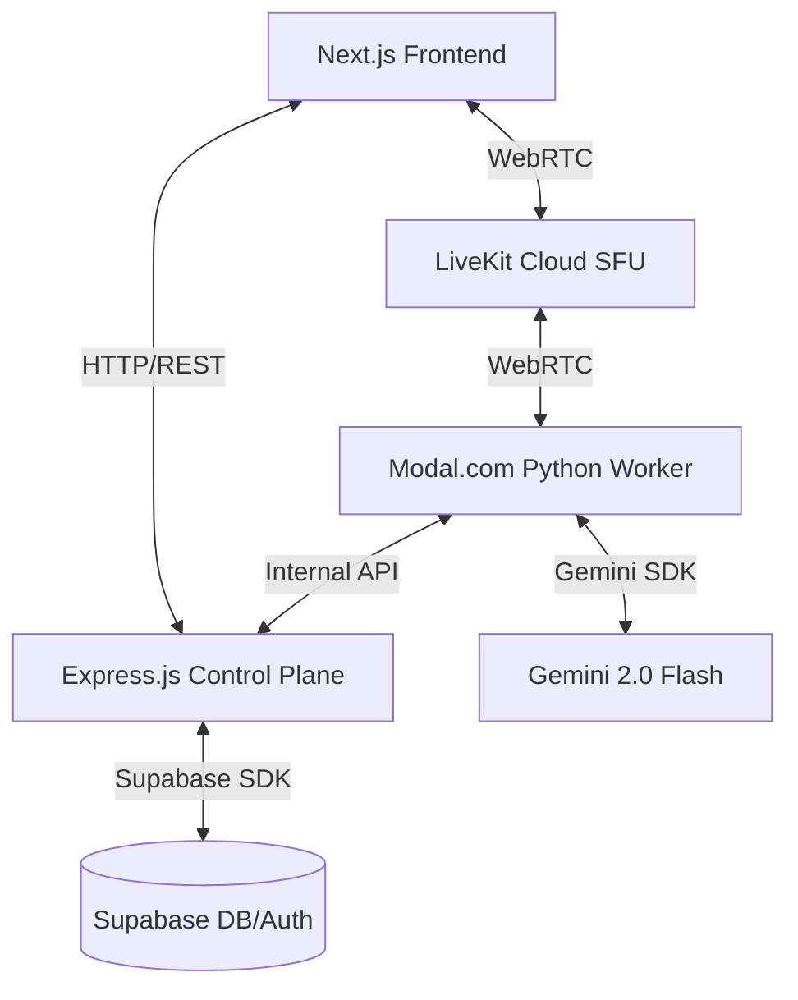

# Thiết Kế Kiến Trúc Kỹ Thuật: SpeakMate "Architecture v2"

## 1. Tổng Quan
SpeakMate sử dụng kiến trúc phân tán hiệu năng cao, tách biệt giữa **Control Plane** (Node.js) và **Data Plane** (Python/Modal). Điều này đảm bảo các xử lý AI nặng không làm nghẽn các tương tác phía người dùng hoặc việc streaming thời gian thực.

## 2. Sơ Đồ Thành Phần

## 3. Quy Trình Xử Lý Hiệu Năng Cao (Voice Pipeline)
Sự tương tác tuân theo một luồng thời gian thực tinh vi được thiết kế để tối ưu hóa độ trễ:
1. **Frontend**: Thu âm thanh qua MediaRecorder/WebRTC ở tần số 48kHz.
2. **LiveKit SFU**: Điều hướng luồng âm thanh binary đến Worker với độ trễ micro giây.
3. **Worker (ManualBridgeAgent)**:
    - **VAD**: Silero VAD phát hiện điểm bắt đầu/kết thúc giọng nói.
    - **STT**: PhoWhisper (Large CTranslate2) chuyển giọng nói tiếng Việt thành văn bản.
    - **LLM**: Gemini 2.0 Flash xử lý ngữ cảnh và tạo phản hồi.
    - **TTS**: NeuTTS truyền phát âm thanh tổng hợp (pcm24k) ngược lại LiveKit.
4. **Data Channel**: Các bản ghi văn bản và tín hiệu "Agent Ready" được gửi qua RTC Data Channel để cập nhật "Optimistic UI".

## 4. Các Quyết Định Kiến Trúc (ADR)
- **Tách Biệt Các Plane**: Node.js xử lý Auth, DB và Logic nghiệp vụ. Python/Modal xử lý STT/TTS chuyên sâu về GPU. Hai bên giao tiếp qua `Internal API` được bảo mật bằng key tùy chỉnh.
- **Externalization Trạng Thái**: Ngữ cảnh (Kịch bản, Lịch sử) được lưu trữ trong Supabase nhưng được Worker truy xuất qua internal API để duy trì "Stateless Workers" cho việc mở rộng theo chiều ngang.
- **Hỗ Trợ Barge-in**: Worker sử dụng hàng đợi tác vụ dựa trên ngắt để dừng tạo TTS ngay khi VAD phát hiện giọng nói của người dùng.

## 5. Bảo Mật & Mở Rộng
- **Giới Hạn Tốc Độ (Rate Limiting)**: Endpoint `/livekit-session` được giới hạn để ngăn chặn lạm dụng tài nguyên tính toán.
- **Tối Ưu Hóa Cold-Start**: Tải trước worker trên trang "Xác nhận" giúp giảm độ trễ hiển thị từ ~30 giây xuống còn <2 giây.
- **JWT Metadata**: Chỉ có ID phiên được chuyển qua token LiveKit để đảm bảo bảo mật và kích thước payload tối thiểu.
